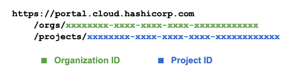

Use the `Explainer` tab to access the forms  for the HCP Requirements and TFC Requirements.
**First create your own [HashiCorp Cloud Platform](https://portal.cloud.hashicorp.com/sign-in) account to get started.**

Continue to the tabs Validate HCP Credentials and Validate TFC Credentials.

#1 - Finding HCP Credentials
============================
<p>In the <code>Explanier</code> tab on the <b><i>HCP Requirements</i></b> slide, for the <code style="color:green">HCP Organization ID</code> and <code style="color:#1974D2">Project ID</code>, the <a href="https://portal.cloud.hashicorp.com/sign-in" target="_blank"> HashiCorp Cloud Platform </a> URL displays the required data:</p>

<p align="center">
      
    </p>

For the `HCP Client ID` and `HCP Client Secret`, follow this guide in how to set up the [Service Principals](https://cloud.hashicorp.com/docs/hcp/admin/service-principals) to find the correct values.

<p><span style="color:yellow">For first time HCP Packer users:</span> after finding your credentials, go to the <b>Packer</b> tab in the navigation panel on the left in your HCP account. Then click <b>Create Free Registry</b> to gain access to your HCP Packer Registry!</p>

#2 - Create TFC Workspace
====================================
<p>2.1 - Go into your Terraform Cloud account to create an <a href="https://app.terraform.io/app/organizations" target="_blank"><span style="color:aqua"><b>organization.</b></span></a> Name that organization anything you want.</p>

<p><span style="color:yellow">For first time Terraform Users:</span> choose <b>"Start from scratch"</b> when choosing your setup workflow. </p>

<p>2.2 - In your organization that you just created, create a new <a href="https://www.terraform.io/cloud-docs/workspaces/creating" target="_blank"><span style="color:aqua"><b>workspace</b></span></a> and choose the <span style="color:aqua"><b><i>CLI-driven workflow</i></b></span>. Name your workspace <code>path-to-packer</code>.</p>

<p>2.3 - Once you have successfully created your workspace, go into your workspace <span style="color:aqua">settings</span>. Click <span style="color:aqua">General</span>. Under <span style="color:aqua">Execution Mode</span>, make sure you are in <span style="color:aqua"><b>Local</span></b>.</p>

<p><span style="color:yellow">Make sure to save your settings before continuing on!</span></p>

<p>Now going back to the <code>Explainer</code> tab, input your <span style="color:aqua"><b>organization</b></span> and your <span style="color:aqua"><b>workspace</b></span>.</p>

<p>To find your TFC API Token, follow <a href="https://app.terraform.io/app/settings/tokens" target="_blank">this</a> link </p>

<p><span style="color:yellow">Keep/store your API Token in a safe place to use in future steps!</span></p>

#3 - Validate HCP Credentials
========================
Now, you can use the `Terminal` tab to manually verify your HCP and TFC credentials.

```bash
# Declare your HCP and TFC credentials
source $APP_HOME/hcp_credentials

# Get HCP Packer API endpoints
source $ASSETS_HOME/api/shortcuts.bash
```
Authenticate with HCP using your Service Principal and generate a bearer token for the session.

```bash
curl -s -u \
  "${HCP_CLIENT_ID}:${HCP_CLIENT_SECRET}" \
  --data 'grant_type=client_credentials&audience=https://api.hashicorp.cloud' \
  'https://auth.hashicorp.com/oauth/token' \
| jq
```

<p>The token is valid for about one (1) hour and you use it to make API calls to the HCP Packer endpoints. <b>We do not need to preserve this token.</b></p>

Call the HCP Packer API and get details of the HCP Packer Registry:
```bash
curl -s -H \
  "Authorization: Bearer ${HCP_CLIENT_TOKEN}" \
  -X GET $HCP_PACKER_API_GET_REGISTRY | jq
```

#4 - Validate TFC Credentials
========================
Now, you can authenticate with TFC using your TFC TOKEN and confirm your identity:

```bash
curl -k -s \
  --header "Authorization: Bearer $TFE_TOKEN" \
  --header "Content-Type: application/vnd.api+json" \
  --request GET $TFC_API_ACCT_DETAILS \
| jq -r '.data.attributes.email'
```

Check the status of your intended TFC Workspace:
```bash
curl -k -s \
  --header "Authorization: Bearer $TFE_TOKEN" \
  --header "Content-Type: application/vnd.api+json" \
  $TFC_API_SHOW_WORKSPACE \
| jq '.data.relationships.organization'
```

#5 - Validate AWS Credentials
========================
Your AWS Credentials are part of the Instruqt platform. To see what these credentials are, use the following commands.

What is our identity?

```bash
aws sts get-caller-identity
```

Confirm we are working in US-EAST-2:

```bash
aws configure get profile.default.region
```

Confirm that we have an assinged VPC:

```bash
aws ec2 describe-vpcs
```

When you have successfully completed the above tasks, you can move on to codifying your runbook!
